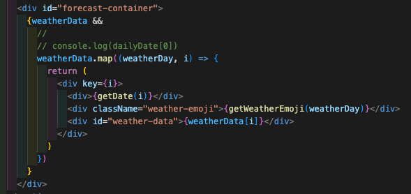

<h1>Project 3: Wanderlust</h1>

<h2>Project Overview</h2>

During the eighth week of the GA Software Engineering immersive course, we were tasked with developing a full-stack app from scratch using the MERN (MongoDB, Express, React.js, and Node.js) framework. 

Our team came up with the idea of 'Wanderlust', a travel destination website that offers inspirational recommendations based on the current weather conditions.  Whether someone wants to visit a hot destination or ski in colder temperatures, Wanderlust provides a tailored list of options to suit their preferences.

<h3>Deployment link</h3>

https://wanderlust-project-3.herokuapp.com/

<h3>Timeframe & Working Team</h3>

This project was working in a group with 3 members (including myself) with a duration of 1 week for completion.  I worked with fellow General Assembly members Ross Rogerson and Rosie Ventrella.

<h3>Technologies Used</h3>

<b>Front-end</b>
- HTML5
- CSS / SASS
- JavaScript
- React.js

<b>Back-end</b>
- Node.js
- Axios
- MongoDB
- Mongoose
- Express

<b>Tools</b>
- VSCode
- npm
- Git
- Github
- Trello
- Excalidraw
- Insomnia

<h2>Brief</h2>

- Build a full-stack application by making your own backend and your own front-end
- Use an Express API to serve your data from a Mongo database
- Consume your API with a separate front-end built with React
- Be a complete product which most likely means multiple relationships and CRUD functionality for at least a couple of models
- Implement thoughtful user stories / wireframes that are significant enough to help you know which features are core MVP and which you can cut
- Have a visually impressive design

<h2>Planning</h2>

**Step 1: Exploring Ideas**

As a group, we began by brainstorming ideas that would align with our shared interests and create a project that we would all be passionate about. Surprisingly, the process was much faster and simpler than anticipated as we discovered a mutual love for travelling. Additionally, I had an idea from a previous project that I couldn't implement due to API constraints, which perfectly aligned with our project's objectives.

Some other ideas we considered were: a restaurant finder in your area (as we are all foodies) and a social media replacement to Facebook. We all agreed the travel idea was our favourite, so we proceeded onto mocking out what the concept might look like.

**Step 2: Formulating the concept**

Right from the outset, I wanted to emphasise that we shared a cohesive vision for our product, which helped ensure that our desired outcomes were in sync. 

During the dark, cold, and gloomy weather of March in the UK, we wanted our product to assist us in discovering destinations across the globe where we could be informed about the current temperature in that location, and subsequently suggest places that align with our temperature preferences.

We explored some weather APIs that we could integrate with to help facilitate this, and we came across a few that did the job well (and free!), the best one being Open Meteo API. 

**Step 3: Creating the Wireframe and Database Diagram**

Creation of wireframe based on the above vision and requirements, at a high-level using Excalidraw - which would help define the HTML and SASS of the page, along with what potential functionality would be needed.

The homepage:

The destinations index page:

The single destination page:

Based on the above, we then created a data diagram of the relationships of the data, using a tool called Quick DBD, which would help inform the creation of the data models / schemas:

And then briefly sketched out the routes and controllers required:

**Step 4: Defining the MVP**

For our minimum product, we all agreed we wanted the basic abilities of being able to have a landing page with carousel of destinations with desired temperature selection, a destination index showing all the results filtering down based on set temperature, a single destination page with more details about the destination (and to leave reviews), and a profile section to manage destinations and reviews

Stretched goals for post-MVP would be to have a nice slide-show mechanic that was smooth when scrolling imagery, a 7-day weather forecast displayed on the single destination page, have the login/register routes available on all pages via a modal (rather than separate routes as listed above), multiple images per destination, 100+ destinations of content to make the site feel authentic and useful, and possibly a search (although we already had a lot of work cut out for us ahead!)

<h2>Build Process</h2>

Initially, we spent the first 2 days together in our group of three developing the core of the server-side work.  The plan was to later split and specialise a little more, but we wanted to work together on the initial stages just so we were all aligned on how it was put together.  We took turns in taking the lead on coding, whilst the other 2 contributed through the steps.  

I really enjoyed this part of the project the most as it felt like we all got on really well with each other and we all contributed well to building the foundations of the product.  This part of the project was incredibly satisfying as it really solidified all the learning we had done over the past few weeks and helped to connect the dots.

We tackled the tasks by breaking them down into little objectives as listed below:

**Step 1:  get the server up and running**

First things first, we created our development environment, installed the necessary packages using npm, and then spun up the server using Express and then connected to MongoDB.  We made sure the server was listening in for requests and then processing them through the middleware.  This was a simple process.  Once we could log this was working correctly, we moved onto the next stage.

**Step 2: setting up the schemas/models for the data**

Secondly, we then defined the Mongoose schemas for the database, which set the blueprint for all the data it will contain.  In our instance, we had a ‘destinationSchema’ which contained all the necessary fields that we required from the wireframe / data diagrams we did previously, along with the associated embedded relationship schemas, in our case the ‘reviewSchema’, that was nested inside the ‘Destinations schema’.  

We repeated a similar process when defining the ‘User’ schema, which would house our user information for login, as well as establish whether they were admin or not.  Regular users could register and login, and add reviews, and admin could do all of that, but also add destinations (which regular users couldn't).  

Once this was done, we then created the models for the database and moved onto the next step.

**Step 3: setting up a test query**

Once we were happy with the way the database was set up and structured, we then moved onto testing this out a little with a small amount of data to ensure it was working as intended.  We created a simple route to get all data from the database and for it to then return the destination data back to the client.  This route did not require any secure routes, so would be easy and quick to test with. 

We initially started by creating a very basic seeds file populated with 3 dummy entries (based on the schema structure we defined previously) and then made sure it populated in the database correctly.  Then we created the basic config for the router to get all destinations, and then created the controller to process and return the data once the request was made.

To our surprise, this all came together very quickly in the same day, and was immensely satisfying when we used Insomnia for the first time to retrieve our first destination data!  A small but massive win for the group and we all loved it!

**Step 4: building out the controllers and routes**

Once we had the basic route working as intended, we then quickly expanded out the routes and controllers, providing the ability to request a single destination according to the destination ID, as well as setting up the Users and their permissions, so that we could add reviews and update destination data.

This also meant we had to add secure routes to the config to ensure users had the appropriate authorisation via a token stored in local storage.

**Step 5: dividing the conquering the workloads**

At this point, we had spent 2 days working together as a group, and built out the backbone of the functionality for the site.  We then decided to divide and conquer the work a little so as to make the best use of our time, but we were also very open to pairing on certain complex items, which I got heavily involved with also.

Ross went on to define the admin and user routes a little more, including the ability to add, update and delete destinations for admin users, and also the ability to add, update and delete reviews for all users, along with the associated error states if the requests were unsuccessful. 

I then focused more on spinning up the React app from scratch, and then started creating the necessary routes for the homepage and the destination index page and their associated JSX.  I also managed to successfully retrieve the destination data using Axios GET request and then setting the destination data into a useState React hook to be manipulated on the front-end.  I also designed the front-end and found various libraries online that I really liked, including a slideshow component, which was used as the homepage centrepiece:

Rosie helped out creating the UI for the login and registration modals and we paired on making sure the tokens were getting stored in the local storage.

At this point, we managed to create the basics of the site, and now it was all about bringing it together.

**Step 6: building out the UI using functional JavaScript, React hooks, and a healthy amount of SASS.**

I continued to work on the UI components on the destination index and single destination pages, and then paired with Ross on retrieving the user, destination and review data from the controllers he created and then populating in the front-end.  I developed a mobile responsive grid using the ‘display: grid’ functionality that was new to me, and experimented with using aspect ratio and object-fit and position SASS properties to help align all the content, including the imagery.  

Here is a screenshot of Ross and I pairing together, building a mobile-first grid component that ingested the destination data, checking the React components to ensure the data is coming through successfully:

Styling tweaks and mobile responsiveness progress on the grid:

One of the hardest elements we found of the project was ensuring that the correct states were being used correctly in React, and the useEffect hooks were rendering the page at the right times.  We managed to get around this by doing plenty of console logging at each step, checking the React components plug-in in Chrome dev tools.

**Step 7: filling the content**

We now had a good foundation of the product, including an awesome mobile-responsive UI, but we were sorely lacking in terms of content.  So the 3 of us spent almost the extent of 1 full day gathering data for over 100+ location data, with a mix of cold, mild, warm and hot destinations!

We had a bit of a production line where Rosie and I would help getting the images for each location (4 of each) and then uploading to Cloudinary, and Ross would create the destinations themselves in the seeds file and start populating with location data and other destination data.  We used Chat-GPT to help us create the content for descriptions and features of each destination, where it would generate recommended sight-seeing, activities, and restaurants in the area, which we then copy and pasted into the seeds file!

It was the most laborious part of the project, but we figured it was worth spending time making sure we had enough content to populate on the site, as the success of the product hinges on there being a great selection of destinations to work with, and let the content do the singing.

**Step 8: completing the finishing touches**

A lot of the hard work had been done now, and it was just a case of putting the finishing touches to the UI together, and getting the details of the styling and branding in place.

Ross and Rosie paired together on the UI for the admin pages to get them up-and-running, whereas I focused on the single destination pages, and added all the necessary components for this page.

I worked on integrating the map from mapbox API, and also an API from Open Meteo, to show a 7-day weather forecast.  I had a lot of fun creating the functional JavaScript for this work, and came together very quickly for both.  I wasn’t sure what issues I would run into with their APIs, but fortunately, it was all very plain sailing and easier than expected!

This is the code I did for showing the weather forecast, which I was proud of:

1) Getting the weather data from the Meteo API, feeding in the longitude and latitude values from our destination data:

2) The JSX showing the component on the page:

3) The functions necessary to show the correct data to the JSX:

**Step 9: Wrapping up and getting it ready for the showcase demo**

On the last day, I was very firm to the group that we were not going to do any major deployments to the codebase and instead tweaks to smaller details were OK.  We did a lot of fine-tuning and the presentation went really well.

<h2>End result</h2>

<h2>Challenges</h2>

**1st challenge:**  I think the hardest challenge was not working together as a unit (we actually really enjoyed working with each other!) but it was harder making sure we were not working on the same files/code as each other at the same time, as we ran into a number of git conflicts, which we had to resolve.  As a group who have not had a huge amount of prior experience with Git, it was quite nerve-racking when we had to merge the code and then resolve conflicts.  The process was not as simple as we would have liked it to be and caused a great deal of anxiety, especially when we had to get the codebase ready for demo!  The key was good communication when committing code changes, and ensuring that we tried to avoid working on the same files at the same time.

**2nd challenge:**  Most of our technical issues were less on the database and server-side of things, which went relatively straightforwardly, but instead were on the React side of things - more specifically on setting the states and then making sure they were being triggered at the correct times using the React useEffect hook.  We found debugging quite difficult and knowing when they were being run on mount vs declaring in the dependency array, and making sure it was being rendered at the correct time.  I still feel like I need more practice in this area.

**3rd challenge:** As we had limited time to complete the project, we found that we had to resort to writing non-optimal code that solves short-term problems, rather than think about the long-term.  For example, we could have refactored the functions to be more reusable and streamlined, and it would have been nicer to spend more time on making the UI more scalable.  Certain content fields, such as the ‘price’ were hardcoded for the demo, so it would have been nice to have more time to refine the content further.  We fully plan to iterate and improve after the demo in this area.

**4th challenge:** The homepage radio button slideshow component that I ‘borrowed’ from the internet is a little limiting on functionality and I ran into a lot of problems trying to customise it and integrate it better with the rest of the elements on the page.  I wanted to completely redo this component midway through the project, but decided against it due to other priorities and a looming deadline!  I was a little frustrated I didn't get this exactly how I wanted it, but either way, it still works great.

<h2>Wins</h2>

We were massively proud of the end result of the website - we think it looks amazing but also works really well! In my view (obviously biased!) it was the best of the group by quite some margin, and we got some great feedback from the demo.

It was great fun working together as a unit.  I did worry a little bit about what the team dynamic might be like when we first started, but that worry quickly dissipated once we got into the swing of things.  My favourite part of the project was the initial stage when the 3 of us worked together on the server-side elements of the site.  We achieved a lot, and very quickly, which put us in good stead for the latter parts of the project.

I really enjoyed pairing with Ross, when combining the back-end and front-end work, and seeing all the data come to life!  I am glad we spent a while making the content really strong, as it made all the difference to the end result.

I also managed to squeeze in more learning on SASS and responsive mobile design work.  Last project I focused too much on desktop-first, which I looked to remedy for this project.  I am very happy with the design and front-end that I implemented.

<h2>Key Learnings</h2>

One of the major wins for me personally, was being able to take all the learnings from the course so far; from the front-end to the back-end, and then be able to connect all the dots together in a full-stack way.  I was worried that the amount we have learnt over the past few weeks would have meant we might have forgotten previous topics, but actually once we got into the swing of things, older learnings came back very easily.  

I really love working across the full-stack.  Last project, I was a bit more focused on the front-end, so it was great working more on the back-end side this time around. I really feel like I learnt a lot on this project, especially being able to look at the high-level and low-level detail.

I created a Trello board to track what we were working on and what to prioritise next, and we did our own team stand-ups, which helped us to organise and plan our work, and ultimately put us in good stead towards the end of the project.

<h2>Bugs</h2>

Only minor bugs with certain responsive mobile breakpoints that were introduced when we added new features late on in the project.  I plan on fixing these soon.

<h2>Future Improvements</h2>

1) I would love to be able to expand on the single destination pages, and make them have a more ‘actionable’ outcome at the end of the journey. I.e. to be able to search for flights or hotels, or some form of e-commerce element to it.  Obviously this was quite out of the remit of the original brief, but would love to add onto it!
2) Adding search and better discoverability of destinations
3) Improve styling on the admin pages. Currently they are quite plain and we could improve this experience.
4) Improve the homepage slideshow as it needs a lot of refactoring, and to also work more integrated with the rest of the site.

